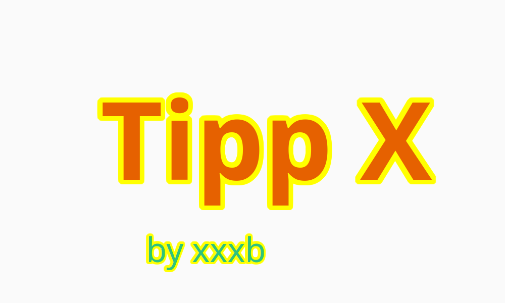

# TippX
Zehnfingerschreiben lernen

# 
 
 

# Kontakt
wenn du Fragen, Hinweise und/oder Verbesserungsvorschläge hast, kannst du das entweder durch die [Codeberg-Oberfläche](https://codeberg.org/xxxb/TippX/issues?state=open) oder durch eine Nachricht an mich herantragen.

E-mail: goldhahn.benedikt@tutanota.de

Mastodon: @xxxb@floss.social

 
 

# Unterstützung
Wenn dir meine Arbeit gefällt, kannst du diesem Repo einen Stern geben und/oder mich hier unterstützen:

<a href="https://coindrop.to/xxxb" target="_blank"></img></a>

# Geschichte
dies ist die 2. Version von TippX. Als ich mit der Entwicklung begonn, war es noch eine Terminal-App. Der Source-Code dieser Version ist auf meinem GitHub einsehbar: https://github.com/xxxb-g/TippX_archive 